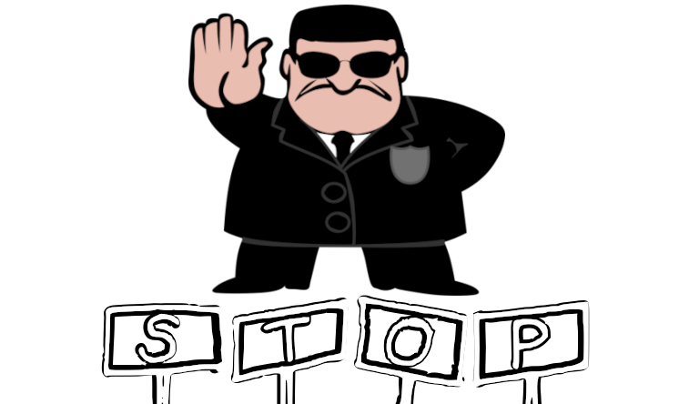
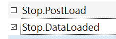

# Stop

> Stop Skyrim right after it starts :)

---

Testing SKSE plugins?

Tired of typing `` `qqq<enter>`` ?

Install these 2x SKSE plugins:

Using your mod manager, enable one of these mods when you want the game to automatically exit after one of these events is reached:

- `kPostLoad` - all SKSE plugins have loaded (_happens before the game UI renders at all, very fast!_)
- `kDataLoaded` - all SKSE and .esp plugins have loaded (_takes a moment, you will see the game UI render_) 
